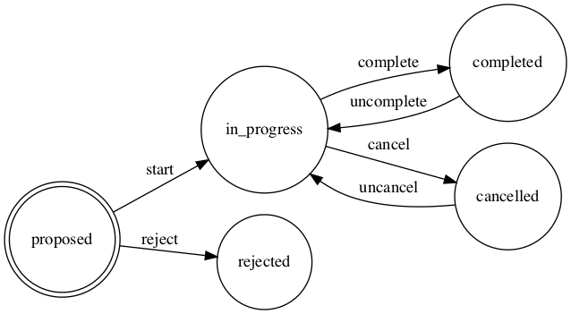
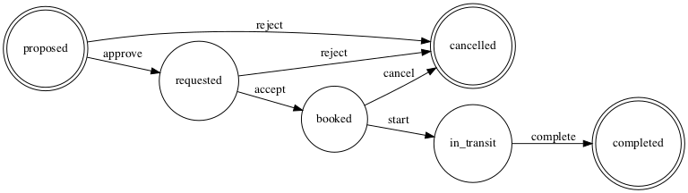

# State Machine Diagrams

This directory contains diagrams of the various state machines. To regenerate the diagrams you can use `make`. You'll need [Graphviz] installed.

[Graphviz]: https://graphviz.org/

## Journeys

## Moves

